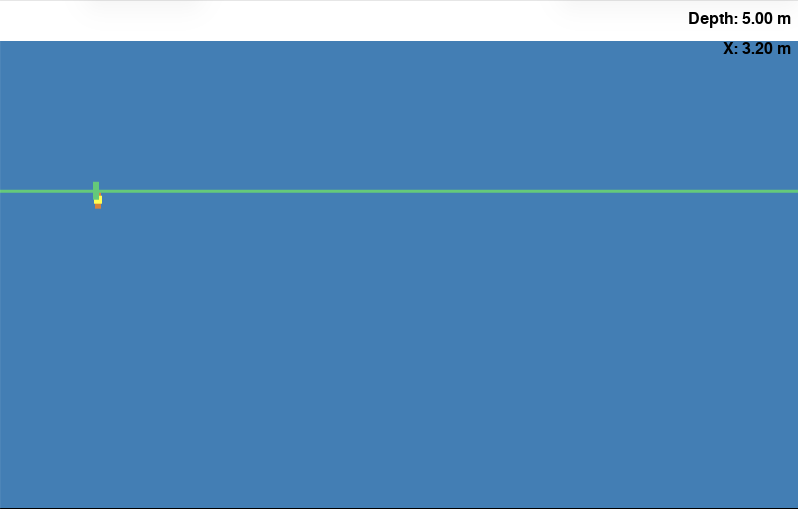

# PID Tuning Practice

ROS 2 Jazzy PID controller: depth + horizontal control, plus n-sweep search coverage.



## Design and Thought Process

### PID

Both directions use the same PD structure

**The depth output has to be negated.** Reading `simulation.py`, thrust is
subtracted in the force calculation, so positive thrust pushes the vehicle
up while depth increases downwards. I observed that becasue the robot keeps
pinning itself at the surface, so I flip the sign of the depth output.

**A constant feed-forward to cancel buoyancy.** The vehicle floats up on its
own, so with P and D alone it can only hold depth by keeping a permanent error, since
when the setpoint is reached, no error exists and therefore causing the PID controller to output
sth near 0 and let the robot float up again. Therefore, I added a constant `-2.0` to the depth output. 
I found that number by trial and erroring different thrust values and -2.0 is nearly the most 
optimal in keepting the robot to stay still in the water.

**No KI term.** KI is left at 0. Once the feed-forward was in, there was nothing for an
integral to correct. When I tried adding one it actually mostly made the overshoot worse,
so i removed it in the end.

The setpoint can be reached at about 5-8 seconds, with minor overshoot. Increasing more on KD 
could slightly improve it, but in reality KD is quite sensitive to noise so prob not the best idea.

### n  sweeps in a search polygon

I use the same PID and FeedForward values as the normal manaual clicking mode. However
I wrote a seperate logic in generating the waypoints and setpoints

A function generates the waypoint list once at startup based on `n`. Each sweep
is one horizontal pass, and the direction alternates each time so the path
zigzags instead of driving back to the start.

The controller keeps track of which waypoint it is on, and moves to the next
one when the vehicle gets close enough to the current one.

There are two modes, selected by a ROS parameter:

```bash
ros2 run assignment2 controller                                   # manual, follows clicks
ros2 run assignment2 controller --ros-args -p mode:=sweep -p n_sweeps:=3
```

Once the sweep finishes it goes back to following clicked setpoints.

## Known limitations

- The buoyancy feedforward constant is slightly off very near the surface. (My guess is it may 
be because the robot is not fully submerged near the surface thereface causing a difference in force)
- The vehicle slows almost to a stop at each corner, because it waits to be within tolerance 
before moving to the next waypoint. (A solution to this is to use time to switch the next waypoints instead)

> [!NOTE]
> Everything below is from the template repo

## Setting up the simulation
This simulation depends on pygame. To install pygame, either run
```bash
sudo apt install python3-pygame
```
or
```bash
pip3 install pygame
```
To run the simulation, add this package to your workspace and build
```bash
colcon build --packages-select assignment2
source install/setup.bash
ros2 run assignment2 simulation
```
## Troubleshooting no GUI output
If you are on WSL, you might need to set up the following to see a GUI output.

Download and install VcXsrv from https://sourceforge.net/projects/vcxsrv/. Run the application and
1. select multiple windows and display number -1
2. select start no client
3. select everything on the extra settings
4. finish

Which the xserver running, on your linux command line run
```bash
export DISPLAY=`grep -oP "(?<=nameserver ).+" /etc/resolv.conf`:0.0
```
Next test if you can see GUI output. We will use xeyes.
```bash
sudo apt install x11-apps
```
Then run 
```bash
xeyes
```
You should see a pair of googly eyes following your cursor.

## Using the simulation
The simulation publishes the following data in `std_msgs/Float64` format
```bash
/depth          # current vehicle depth
/setpoint_depth # current setpoint for depth
/x              # current vehicle x position
/setpoint_x     # current setpoint for x position
```
The simulation also subscribes to the following topic (also of `std_msgs/Float64` type)
```bash
/thrust_depth   # -4 to 4, with upwards positive
/thrust_x
```
Publishing to this topic will allow you to control the vertical thrust of the vehicle.

You can mouse click on the GUI to change the setpoint.

## Running the controller
Make the relevant changes to the controller node template. Then build, source and run 
```bash
ros2 run assignment2 controller
```
to test your controller.
